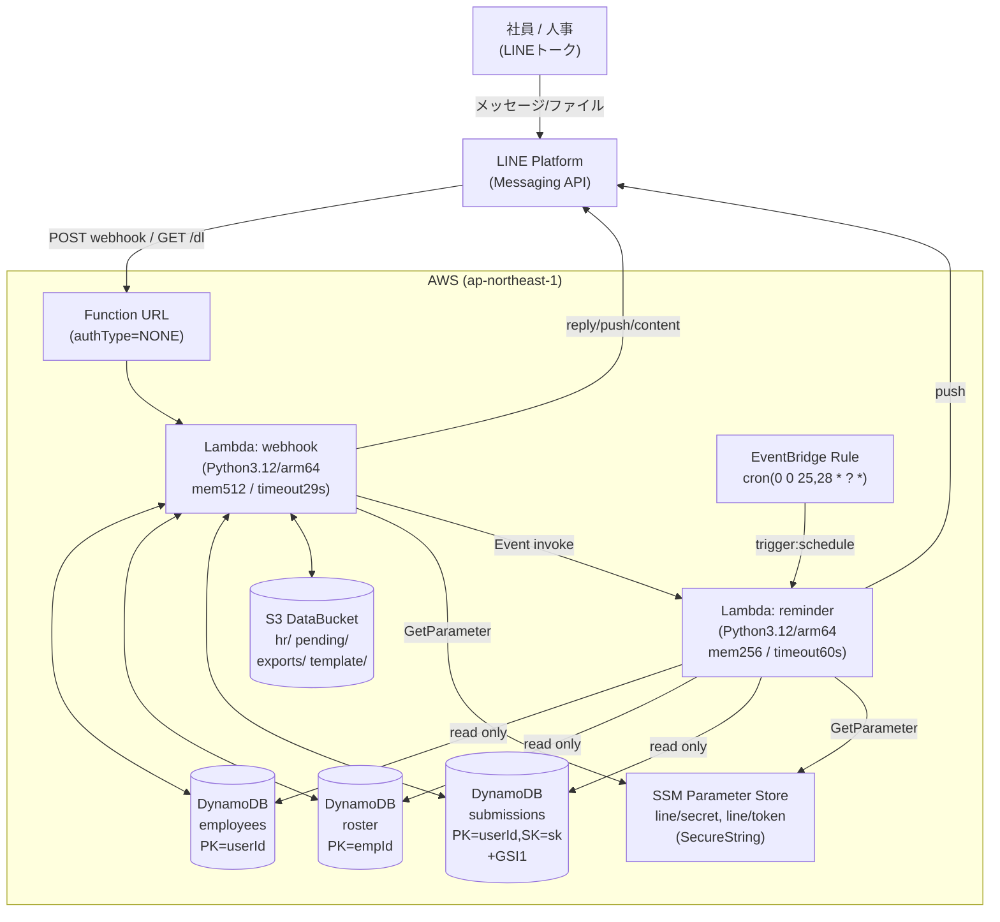
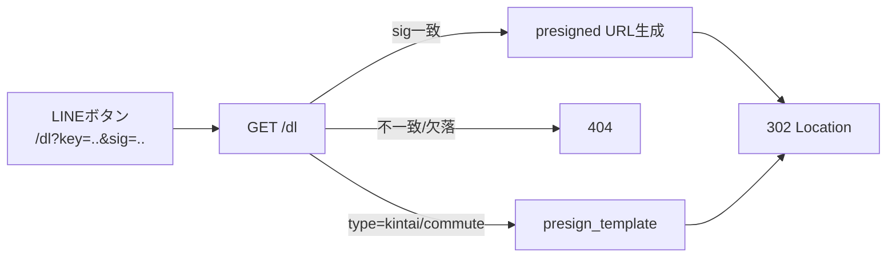
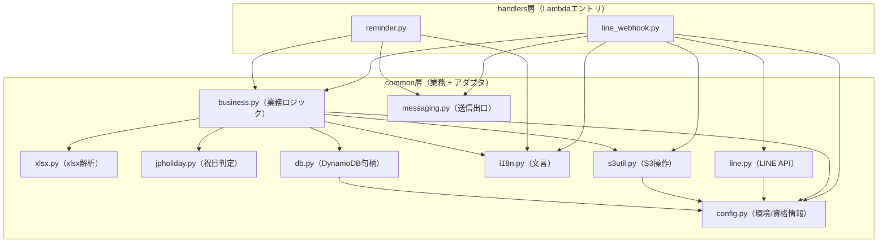
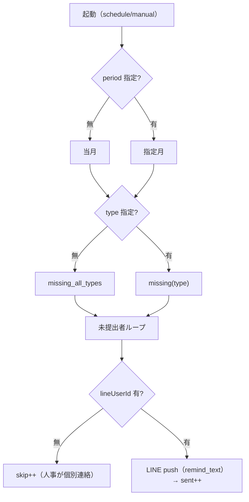

# 基本設計書

BrightStar 社内システム ｜ 勤怠・通勤費 提出 LINE Bot

| 項目 | 内容 |
|---|---|
| 文書名 | 基本設計書 |
| システム名 | BrightStar 社内システム（勤怠・通勤費 提出 LINE Bot） |
| 版数 | 1.0 |
| 作成日 | 2026-06-17 |
| 作成者 | 設計担当（アプリ/インフラ設計） |
| 上位文書 | `docs/01_要件定義書.md`（FR-01〜FR-28 / NFR-01〜15） |
| 用途 | 受託開発 社内システム（基本設計） |

本書は要件定義書（FR/NFR）を受けて、システム全体構成・方式・機能構成・インターフェース・データベース論理設計・バッチ・非機能設計を定める基本設計書である。実装コードを事実の正とし、各設計項目に **BD-NN / IF-NN / TBL-NN** のIDを付与する。曖昧点は「※注記」で明示する。

---

## 1. 改訂履歴

| 版数 | 日付 | 改訂内容 | 担当 |
|---|---|---|---|
| 1.0 | 2026-06-17 | 初版作成（要件定義書・実装コードに基づく） | 設計担当 |

---

## 2. システム全体構成（BD-01）

### 2.1 アーキテクチャ概要

フルサーバーレス構成（NFR-06）。LINE 公式アカウントを唯一の UI とし、AWS Lambda（Function URL）が webhook 入口となる。データは DynamoDB 3 表（社員名簿・LINE 紐付け・提出記録）と S3（提出物・テンプレート）に保管。月末リマインドは EventBridge cron で別 Lambda を起動する。LINE 資格情報は SSM Parameter Store（SecureString）に格納する。

### 2.2 AWS 構成図（Mermaid）

### 2.3 構成要素一覧

| 構成要素 | サービス | 役割 | 主要設定 | 関連NFR |
|---|---|---|---|---|
| webhook 入口 | Lambda Function URL | LINE webhook（POST）/ ダウンロード短縮リンク（GET /dl）受口 | authType=NONE（PRE-09） | NFR-02/03 |
| webhook Lambda | Lambda | 署名検証・イベント解析・ルーティング・提出処理・人事コマンド | Py3.12/arm64, mem512, timeout29s | NFR-08/09 |
| reminder Lambda | Lambda | 未提出者抽出・LINE push（定時/手動） | Py3.12/arm64, mem256, timeout60s | NFR-06 |
| 定時起動 | EventBridge Rule | 月末リマインドの cron 起動 | `cron(0 0 25,28 * ? *)` | FR-24 |
| 社員名簿 | DynamoDB roster | 主データ（誰が提出すべきか） | PK=empId, On-Demand, PITR | NFR-07/11 |
| LINE 紐付け | DynamoDB employees | LINE 紐付け・会話状態 | PK=userId, On-Demand, PITR | NFR-07/11 |
| 提出記録 | DynamoDB submissions | 提出履歴 + GSI1（月次差集計） | PK=userId,SK=sk + GSI1, PITR | NFR-07/11 |
| ファイル保管 | S3 DataBucket | 提出物・テンプレート・保留・ZIP | BPA全ON, SSE-S3, enforceSSL, versioned | NFR-05/10 |
| 資格情報 | SSM Parameter Store | LINE secret/token | SecureString | NFR-01 |

---

## 3. 方式設計（BD-02）

### 3.1 サーバーレス採用理由（BD-02-1 ／ NFR-06, NFR-07）

- 社内少人数・月次バースト型の利用特性に対し、固定稼働コストを排しイベント従量課金とするためフルサーバーレスを採用。
- Lambda は Python 3.12 / arm64、標準ライブラリ＋boto3 のみ（外部依存なし。xlsx 解析・日本祝日判定も自前実装）でビルド・運用を簡素化（NFR-09）。
- DynamoDB は On-Demand（PAY_PER_REQUEST）で容量設計不要（NFR-07）。

### 3.2 Function URL 採用（BD-02-2 ／ PRE-09）

- API Gateway を介さず Lambda Function URL を直接 webhook 入口に採用。認証タイプは NONE（公開）。
- 公開エンドポイントのアクセス制御は二層で担保する。
  - POST（webhook）: LINE 署名検証（HMAC-SHA256, NFR-02）。不正は 403。
  - GET（/dl）: HMAC 署名付き短縮リンク（NFR-03）。不正は 404。

### 3.3 同期 / 非同期の使い分け（BD-02-3 ／ NFR-08）

| 処理 | 方式 | 理由 |
|---|---|---|
| webhook 全般（提出・問合せ・人事一覧・一括ZIP） | 同期（webhook Lambda 内で完結） | LINE reply は replyToken の有効期限内に返す必要があるため即時処理 |
| 催促（手動リマインド） | 非同期（reminder Lambda を `InvocationType=Event` で invoke） | 連携人数ぶんの push を webhook の 29 秒制約から切り離し、webhook は即時に件数を返信 |
| 定時リマインド | 非同期（EventBridge → reminder Lambda） | 利用者リクエストと独立した定時バッチ |

※webhook は各イベントを個別 try/except で処理し、1 件失敗が全体に波及しない（全体は常に 200 応答）。

### 3.4 短縮ダウンロードリンク方式（BD-02-4 ／ FR-14, NFR-03）

presigned URL は Lambda 実行ロールの一時資格情報で生成されるため URL が長大化し、LINE ボタン URI の 1000 字上限を超える。これを回避するため、提出物 S3 キーに対し短縮リンクを発行する。

- 形式: `GET {base}/dl?key={urlencode(s3key)}&sig={hmac16}`
- 署名: `HMAC-SHA256(line_secret, s3key)` の先頭 16 桁（`_sign_key`）。
- 検証: `hmac.compare_digest` で定数時間比較。一致時のみ presigned URL を生成し **302 リダイレクト**。不一致・欠落は **404**。
- テンプレートは署名不要（`?type=kintai|commute`）で presigned URL へ 302。

---

## 4. 機能構成一覧（BD-03）

### 4.1 レイヤ構成

3 層（handlers / common 業務層 / インフラ層）。Lambda パッケージ `lambda/` 配下。

### 4.2 モジュール責務一覧

| モジュール | 層 | 責務 |
|---|---|---|
| `handlers/line_webhook.py` | handlers | webhook の HTTP 入口。署名検証・メソッド判定（POST/GET）・イベントルーティング・提出フロー・人事コマンド・短縮リンク発行/解決・文案構築。 |
| `handlers/reminder.py` | handlers | 定時/手動リマインドの本体。未提出者抽出・LINE push・skip 集計。 |
| `common/business.py` | common 業務 | 業務ロジック中核。名簿 CRUD・登録照合・種別判定・内容検証（年月/氏名/休日/欠落）・提出保存・保留管理・未提出差集合・提出マトリクス。 |
| `common/xlsx.py` | common 業務 | 標準ライブラリのみの xlsx セル読取（sharedStrings/inlineStr/数値・日付シリアル対応）。 |
| `common/jpholiday.py` | common 業務 | 日本の祝日判定（固定日・ハッピーマンデー・春分秋分・振替・国民の休日）。 |
| `common/i18n.py` | common 業務 | ユーザー向け文言（日本語既定/中国語併記）と種別表示名。 |
| `common/line.py` | common アダプタ | LINE Messaging API アダプタ（署名検証・イベント解析・reply/push・buttons/carousel・content 取得）。 |
| `common/messaging.py` | common アダプタ | 送信出口の抽象（現状 LINE push のみ。将来の多チャネル拡張点）。 |
| `common/s3util.py` | common インフラ | S3 提出物存取・キー設計・presigned URL・保留転正・月次ZIP生成。 |
| `common/db.py` | common インフラ | DynamoDB リソース/テーブル句柄。 |
| `common/config.py` | common インフラ | 環境変数集約・業務定数・SSM 資格情報の遅延取得とプロセス内キャッシュ。 |

---

## 5. 画面・インターフェース設計（メッセージUI設計）（BD-04）

本システムは GUI を持たず、LINE トーク上のメッセージが UI である。コマンド（テキスト/ファイル送信）と応答の対応を以下に定める。応答種別は text / buttons（templateボタン）/ carousel / event-driven push を用いる。

### 5.1 社員向けメッセージUI（BD-04-1）

| UI-ID | トリガ/コマンド例 | 入力 | 応答種別 | 応答概要 | 対応FR |
|---|---|---|---|---|---|
| UI-E01 | 友だち追加（subscribe） | follow イベント | text | welcome + 氏名入力依頼 | FR-01 |
| UI-E02 | 氏名（フルネーム）送信 | text | text | 名簿照合→登録完了/名簿外/同姓同名 | FR-02/03/04 |
| UI-E03 | Excel ファイル送信 | file/image | text（複数可） | 種別自動判定→検証→受付/警告 | FR-05/07〜11 |
| UI-E04 | 種別不明ファイル→「勤怠」「経費」等 | file→text | text | 保留→種別語で転正・検証・受付 | FR-06 |
| UI-E05 | 「テンプレ」「模板」「様式」等 | text | buttons | 空白様式2種のDLボタン | FR-12 |
| UI-E06 | 「履歴」「我的提交」等 | text | text + carousel | 提出一覧 + 最新分DLボタン | FR-13 |
| UI-E07 | 「メニュー」「help」「?」等 | text | text | 社員メニュー | FR-26 |
| UI-E08 | 未認識テキスト | text | text | フォールバック案内 | FR-27 |

### 5.2 人事向けメッセージUI（BD-04-2）

人事判定（`is_hr`）不成立時は `hr_only` を返す。

| UI-ID | トリガ/コマンド例 | 入力 | 応答種別 | 応答概要 | 対応FR |
|---|---|---|---|---|---|
| UI-H01 | 「一覧[202606]」「提出状況」等 | text | text（最大5通） | 提出マトリクス（未提出置頂・✓/✗） | FR-15 |
| UI-H02 | 「未提出確認[202606]」等 | text | text | 未提出者一覧（種別指定可） | FR-16 |
| UI-H03 | 「催促」「リマインド」等 | text | text + push(非同期) | reminder Event invoke・連携人数返信 | FR-17 |
| UI-H04 | 「一括DL」「打包」「zip」等 | text | buttons / text | 当月ZIP生成・DLボタン（無ければ案内） | FR-18 |
| UI-H05 | 「名簿」「社員一覧」等 | text | text | 名簿一覧 | FR-19 |
| UI-H06 | 「社員追加 山田太郎 開発部 [hr]」 | text | text + push | 追加・他人事へ通知 | FR-20/23 |
| UI-H07 | 「社員変更 E003 部署 営業部」 | text | text + push | 変更・他人事へ通知 | FR-21/23 |
| UI-H08 | 「社員削除 E003」 | text | text + push | 削除・他人事へ通知 | FR-22/23 |
| UI-H09 | （人事も社員機能を利用可） | - | - | テンプレ/履歴/提出も可 | FR-05〜14 |

※種別語（勤怠/経費）の検出は `infer_type`、月の抽出は `normalize_period`、人事判定は `is_hr`。

### 5.3 システム起点 push（BD-04-3）

| UI-ID | 起点 | 応答種別 | 概要 | 対応FR |
|---|---|---|---|---|
| UI-S01 | 跨月再提出 | push | 全人事へ再確認通知（操作者除く） | FR-25 |
| UI-S02 | 名簿 CRUD | push | 操作者以外の全人事へ変更通知 | FR-23 |
| UI-S03 | EventBridge cron | push | 当月未提出者（連携済）へ自動督促 | FR-24 |

---

## 6. 外部インターフェース設計（BD-05）

### 6.1 IF-01 LINE Messaging API（webhook 受信）

| 項目 | 内容 |
|---|---|
| 方向 | LINE → 本システム（POST） |
| エンドポイント | Function URL（authType=NONE） |
| 認証 | `X-Line-Signature` を `base64(HMAC-SHA256(channel_secret, raw_body))` で検証（`line.verify_signature`） |
| 入力 | webhook JSON（events[]）。message(text/file/image) / follow / unfollow を解析（`line.parse_events`） |
| 出力 | 200（処理）/ 403（署名NG）。本文 "OK" / "bad signature" |
| 異常系 | 署名欠落・不一致は 403。個別イベント失敗でも全体 200。 |
| 関連 | FR-28, NFR-02 |

### 6.2 IF-02 LINE Messaging API（reply / push）

| 項目 | 内容 |
|---|---|
| 方向 | 本システム → LINE（POST） |
| エンドポイント | `https://api.line.me/v2/bot/message/reply`、`/push` |
| 認証 | `Authorization: Bearer {channel access token}`（SSM 取得） |
| 入力 | reply: {replyToken, messages[]} / push: {to, messages[]} |
| メッセージ種別 | text / template(buttons) / template(carousel) |
| 出力 | `{errcode:0}` 成功 / `{errcode:HTTPコード}` 失敗（ログ出力、処理継続） |
| 制約 | buttons: actions≤4, label≤20字, uri≤1000字 / carousel: columns≤10, 各列ボタン数統一 |
| 関連 | FR-01〜FR-27 |

### 6.3 IF-03 LINE Messaging API（content 取得）

| 項目 | 内容 |
|---|---|
| 方向 | 本システム → LINE（GET） |
| エンドポイント | `https://api-data.line.me/v2/bot/message/{messageId}/content` |
| 認証 | `Authorization: Bearer {token}` |
| 入力 | messageId |
| 出力 | ファイルバイナリ（失敗時 None、タイムアウト30秒） |
| 関連 | FR-05 |

### 6.4 IF-04 Function URL `GET /dl`（短縮ダウンロードリンク）

| 項目 | 内容 |
|---|---|
| 方向 | LINE クライアント → 本システム（GET） |
| URL | `{base}/dl` |
| パラメタ（テンプレ） | `type` = `kintai` \| `commute` |
| パラメタ（提出物/ZIP） | `key` = S3キー（URLエンコード）, `sig` = HMAC16桁 |
| 処理 | type 指定→`presign_template`→302 / key+sig 一致→`presign_get`→302 / 不一致→404 |
| 出力 | 302（Location: presigned URL）/ 404（not found） |
| ファイル名 | presigned に Content-Disposition（ASCII兜底+RFC5987 UTF-8）付与（NFR-15）。`.zip` は content-type=application/zip |
| 関連 | FR-12, FR-14, FR-18, NFR-03, NFR-15 |

### 6.5 IF-05 SSM Parameter Store（資格情報取得）

| 項目 | 内容 |
|---|---|
| 方向 | 本システム → SSM（GetParameter, WithDecryption=true） |
| パラメタ | `/{appName}/{stage}/line/secret`、`/.../line/token`（SecureString） |
| 認証 | IAM（対象2パラメータに限定＋KMS Decrypt は ssm 経由条件付け） |
| 振る舞い | プロセス内キャッシュ（`config._cache`）。コールドスタート時のみ取得 |
| 関連 | NFR-01, NFR-04 |

### 6.6 IF-06 Lambda Invoke（webhook → reminder 非同期）

| 項目 | 内容 |
|---|---|
| 方向 | webhook Lambda → reminder Lambda |
| 方式 | `InvocationType=Event`（非同期） |
| Payload | `{trigger:"manual", period, by}` |
| 関連 | FR-17, NFR-08 |

---

## 7. データベース論理設計（BD-06）

DynamoDB 3 表。すべて On-Demand（NFR-07）、PITR 有効・AWS 管理鍵で暗号化（NFR-11）。

### 7.1 TBL-01 employees（LINE 紐付け・会話状態）

| 属性名 | 型 | PK/SK | 用途 | 例 |
|---|---|---|---|---|
| userId | S | **PK** | LINE ユーザー識別子（`line:` 前缀付き） | `line:U1234...` |
| status | S | - | 会話状態（`awaiting_name` / `active`） | `active` |
| empId | S | - | 紐付いた名簿の社員番号 | `E003` |
| name | S | - | 紐付け時の氏名（名簿由来） | `山田太郎` |
| pendingKey | S | - | 種別不明保留ファイルの S3 キー | `pending/line_U.../file.xlsx` |
| pendingFile | S | - | 保留ファイル名 | `file.xlsx` |
| createdAt | S | - | 作成時刻（UTC ISO） | `2026-06-17T00:00:00+00:00` |

- 用途: LINE ログイン状態の保持と、種別不明ファイルの保留ポインタ。
- アクセス: `get_item(userId)` 中心。

### 7.2 TBL-02 roster（社員名簿・主データ）

| 属性名 | 型 | PK/SK | 用途 | 例 |
|---|---|---|---|---|
| empId | S | **PK** | 社員番号（`E%03d` 自動採番） | `E001` |
| name | S | - | 氏名（登録/照合キー） | `山田太郎` |
| department | S | - | 所属部署 | `開発部` |
| role | S | - | 役割（`employee` / `hr`） | `hr` |
| lineUserId | S | - | 紐付け済 LINE ユーザー（未紐付けは無し） | `line:U1234...` |
| createdAt | S | - | 作成時刻 | `2026-06-17T...` |
| updatedAt | S | - | 更新時刻（変更時のみ） | `2026-06-17T...` |

- 用途: 「誰が提出すべきか」を決める主データ。提出対象は名簿全員（LINE 未紐付けでも一覧表示, PRE-02）。
- アクセス: `scan`（全件・並び替え）、`get_item(empId)`、氏名照合は scan のクライアントフィルタ。

### 7.3 TBL-03 submissions（提出記録）

| 属性名 | 型 | PK/SK | 用途 | 例 |
|---|---|---|---|---|
| userId | S | **PK** | 提出者 LINE ユーザー | `line:U1234...` |
| sk | S | **SK** | `{period}#{type}` | `202606#kintai` |
| gsi1pk | S | GSI1-PK | `{period}#{type}`（月次差集計） | `202606#kintai` |
| gsi1sk | S | GSI1-SK | userId | `line:U1234...` |
| period | S | - | 対象年月（YYYYMM） | `202606` |
| type | S | - | 種別（kintai/commute） | `kintai` |
| s3Key | S | - | 提出物 S3 キー | `hr/2026/06/worktimes/...xlsx` |
| fileName | S | - | 保存ファイル名 | `作業時間記録簿（山田太郎）_202606.xlsx` |
| submittedAt | S | - | 提出時刻（UTC ISO, NFR-13） | `2026-06-17T...` |

- アクセス:
  - 個人履歴: `query(userId)`（FR-13）。
  - 再提出判定: `get_item(userId, "{period}#{type}")`（FR-25）。

### 7.4 GSI1 設計意図（TBL-04）

| 項目 | 内容 |
|---|---|
| index 名 | GSI1（ProjectionType=ALL） |
| gsi1pk | `{period}#{type}`（例 `202606#kintai`） |
| gsi1sk | userId |
| 用途 | 「ある月・ある種別の提出者集合」を `query(gsi1pk)` で取得し、roster（提出対象）との差集合で**未提出者**を算出する（`submitters` → `missing` / `missing_all_types`）。 |
| 効果 | submissions の全 scan を回避し、月次の未提出抽出・一覧・催促・定時リマインドを効率化（FR-15/16/17/24）。 |

### 7.5 S3 キー設計（TBL-05）

| プレフィックス | 用途 | キー例 | ライフサイクル/タグ |
|---|---|---|---|
| `hr/template/` | 空白様式（CDK で配備） | `hr/template/作業時間記録簿.xlsx`, `hr/template/経費.xlsx` | 管理対象外（永続） |
| `hr/{yyyy}/{mm}/worktimes/` | 勤怠提出物 | `hr/2026/06/worktimes/作業時間記録簿（山田太郎）_202606.xlsx` | tag `lifecycle=managed`（60日 Deep Archive→365日削除, NFR-10） |
| `hr/{yyyy}/{mm}/expenses/` | 経費提出物 | `hr/2026/06/expenses/経費（山田太郎）_202606.xlsx` | tag `lifecycle=managed`（同上） |
| `pending/` | 種別不明の一時保管 | `pending/line_U.../file.xlsx` | 7日で自動削除（NFR-10） |
| `exports/` | 月次ZIP | `exports/202606.zip` | 3日で自動削除（NFR-10） |

- バケットはバージョニング ON。重複提出は新バージョンとして保持（旧バージョンも 60日 Deep Archive→365日削除）。

---

## 8. バッチ設計（BD-07）

### 8.1 EventBridge cron（FR-24）

| 項目 | 内容 |
|---|---|
| ルール名 | `{prefix}-reminder-schedule` |
| スケジュール式 | `cron(0 0 25,28 * ? *)`（CDK context `reminderCron` で上書き可） |
| 意味 | UTC 0時0分 = **JST 9時0分**、**毎月 25日・28日**に起動 |
| ターゲット | reminder Lambda（入力 `{trigger:"schedule"}`） |

※cron は UTC 評価。Lambda 環境変数 `TZ=Asia/Tokyo` は `current_period` 等の表示TZに作用するが、EventBridge cron 自体は UTC のため「JST 9時」となる。OUT-04 により配信時刻のセルフ変更 UI は対象外。

### 8.2 reminder 動作（FR-24, PRE-05）

- 連携済の未提出者のみ push。未連携者は skip 集計（PRE-05）。
- 戻り値 `{sent, period, type}`。

---

## 9. 非機能設計（BD-08）

### 9.1 IAM 最小権限（BD-08-1 ／ NFR-04）

| プリンシパル | リソース | 権限 | 根拠 |
|---|---|---|---|
| webhook Lambda | employees / roster / submissions | Read/Write（GSI 含む） | 提出記録・名簿CRUD・会話状態更新 |
| webhook Lambda | S3 DataBucket | Read/Write | 提出物保存・テンプレ/ZIP取得 |
| webhook Lambda | reminder Lambda | lambda:InvokeFunction | 手動催促の非同期 invoke |
| webhook Lambda | SSM 2パラメータ | ssm:GetParameter（ARN限定） | LINE 資格情報取得 |
| webhook Lambda | KMS | kms:Decrypt（`kms:ViaService=ssm.{region}` 条件付き） | SecureString 復号 |
| reminder Lambda | employees / roster / submissions | **Read のみ** | 未提出抽出（書込不要） |
| reminder Lambda | SSM 2パラメータ / KMS | GetParameter / Decrypt（同条件） | push 用 token 取得 |

### 9.2 S3 ライフサイクル設計（BD-08-2 ／ NFR-10）

| ルールID | 対象 | 移行 | 失効 |
|---|---|---|---|
| expire-pending | `pending/` | - | 7日で削除 |
| expire-exports | `exports/` | - | 3日で削除 |
| submissions-archive-expire | tag `lifecycle=managed` | 60日で Deep Archive（現行/旧版とも） | 365日で削除（現行/旧版とも） |

### 9.3 暗号化・保護・PITR（BD-08-3 ／ NFR-05, NFR-11, NFR-14）

| 項目 | 設計 |
|---|---|
| S3 | Block Public Access 全ON / SSE-S3 / enforceSSL / versioned |
| DynamoDB | AWS 管理鍵で暗号化 / PITR 有効（3表） |
| 削除ポリシー | prod=RETAIN / dev・staging=DESTROY + autoDeleteObjects |
| タグ | 全リソースに Project / ManagedBy=cdk / Stage |

### 9.4 ログ・性能・国際化・TZ（BD-08-4）

| 項目 | 設計 | 根拠 |
|---|---|---|
| ログ | `print` で CloudWatch Logs へ（route error / push fail / reminder 集計） | NFR-08 |
| 性能 | webhook timeout 29s（一括ZIP含む）/ 重処理は非同期分離 / イベント個別 try/except | NFR-08 |
| 国際化 | 文言は i18n 集約。日本語既定・中国語併記。`DEFAULT_LANG=ja` | NFR-12 |
| TZ | 記録は UTC（submittedAt）、表示は JST。`TZ=Asia/Tokyo` | NFR-13 |
| 保守性 | 標準ライブラリ＋boto3 のみ | NFR-09 |

---

## 10. 要件 → 基本設計トレース表（BD-09）

| 要件ID | 設計項目ID | 設計箇所 |
|---|---|---|
| FR-01 | UI-E01 / BD-04 | メッセージUI（社員）友だち追加 |
| FR-02 | UI-E02 / BD-04 | 初回登録（氏名照合） |
| FR-03/04 | UI-E02 / BD-04 | 名簿外/同姓同名応答 |
| FR-05 | UI-E03 / IF-03 / TBL-03/05 | ファイル提出（種別判定・content取得・保存） |
| FR-06 | UI-E04 / TBL-01/05 | 保留・種別確認 |
| FR-07/08 | UI-E03 / TBL-05 | 年月・氏名チェック |
| FR-09/10 | UI-E03 | 休日勤務・日付欠落警告 |
| FR-11 | UI-E03 / TBL-03/05 | 保存・記録 |
| FR-12 | UI-E05 / IF-04 / TBL-05 | テンプレDL（短縮リンク） |
| FR-13 | UI-E06 / IF-04 / TBL-03 | 個人履歴 |
| FR-14 | IF-04 / BD-02-4 | 短縮DLリンク |
| FR-15 | UI-H01 / TBL-04 | 提出状況一覧 |
| FR-16 | UI-H02 / TBL-04 | 未提出抽出 |
| FR-17 | UI-H03 / IF-06 / BD-02-3 | 催促（非同期invoke） |
| FR-18 | UI-H04 / IF-04 / TBL-05 | 一括DL（ZIP） |
| FR-19 | UI-H05 / TBL-02 | 名簿一覧 |
| FR-20/21/22 | UI-H06/07/08 / TBL-02 | 名簿 追加/変更/削除 |
| FR-23 | UI-S02 / BD-04-3 | 名簿変更ブロードキャスト |
| FR-24 | UI-S03 / BD-07 | 定時リマインド |
| FR-25 | UI-S01 / BD-04-3 / TBL-03 | 跨月再提出通知 |
| FR-26 | UI-E07 / UI-H | メニュー |
| FR-27 | UI-E08 | 未認識フォールバック |
| FR-28 | IF-01 / BD-02-2 | webhook署名検証 |
| NFR-01 | IF-05 / BD-08 | SSM資格情報 |
| NFR-02 | IF-01 / BD-02-2 | 署名検証 |
| NFR-03 | IF-04 / BD-02-4 | リンク改竄防止 |
| NFR-04 | BD-08-1 | IAM最小権限 |
| NFR-05 | BD-08-3 | S3保護 |
| NFR-06/07 | BD-01 / BD-02-1 | サーバーレス/On-Demand |
| NFR-08 | BD-02-3 / BD-08-4 | webhook応答制約 |
| NFR-09 | BD-03 / BD-08-4 | 保守性（標準ライブラリ） |
| NFR-10 | BD-08-2 / TBL-05 | S3ライフサイクル |
| NFR-11 | BD-08-3 / TBL-01〜03 | PITR/暗号化 |
| NFR-12 | BD-08-4 | 国際化 |
| NFR-13 | BD-08-4 / TBL-03 | タイムゾーン |
| NFR-14 | BD-08-3 | 削除ポリシー/タグ |
| NFR-15 | IF-04 | ファイル名互換 |

---

（以上）
