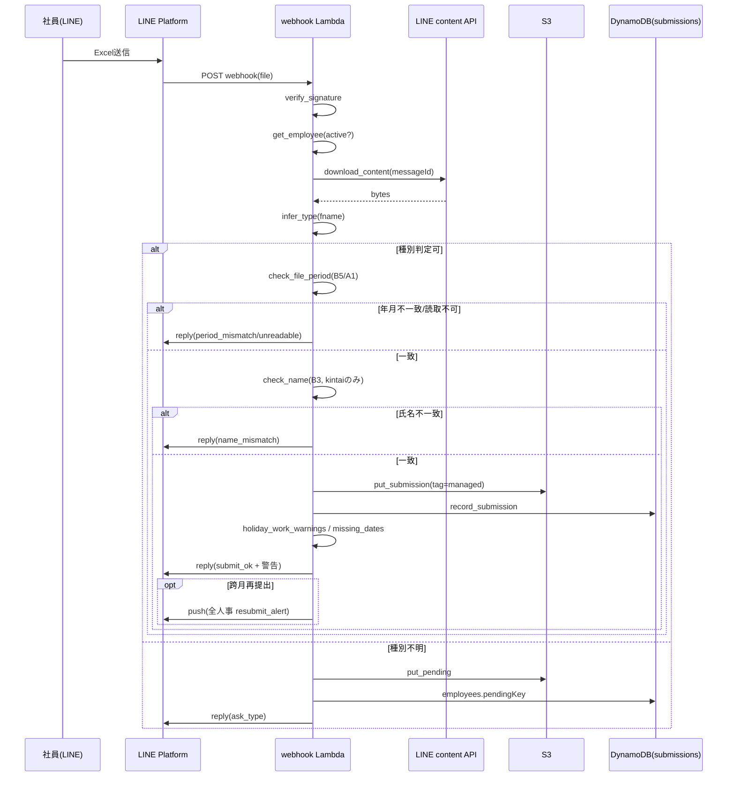
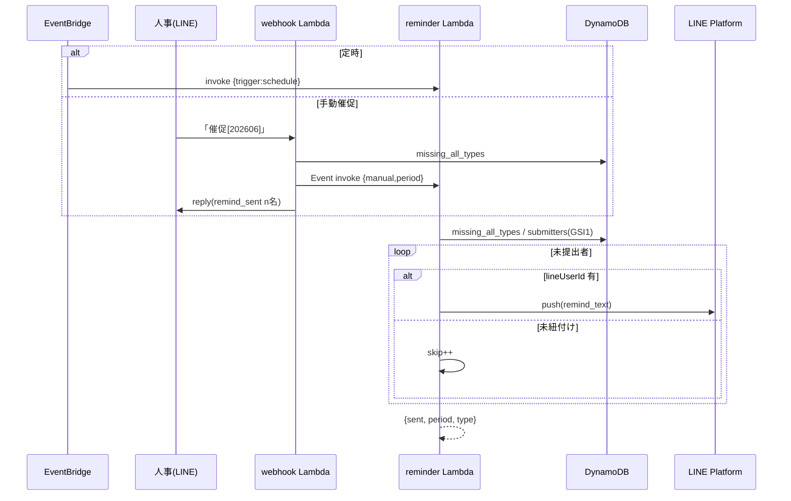
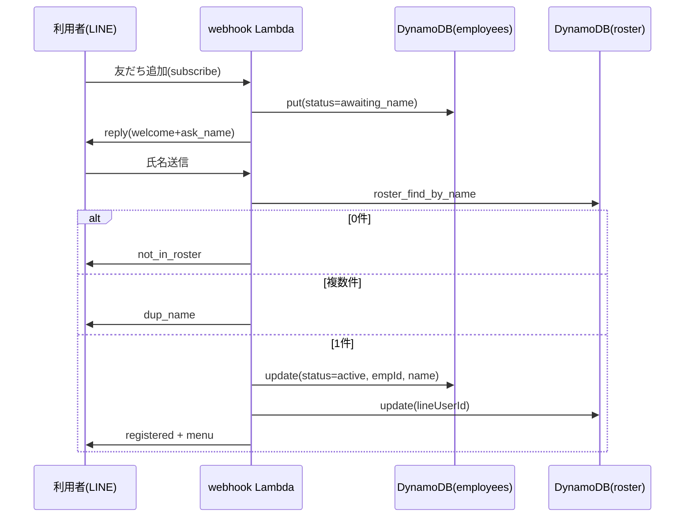
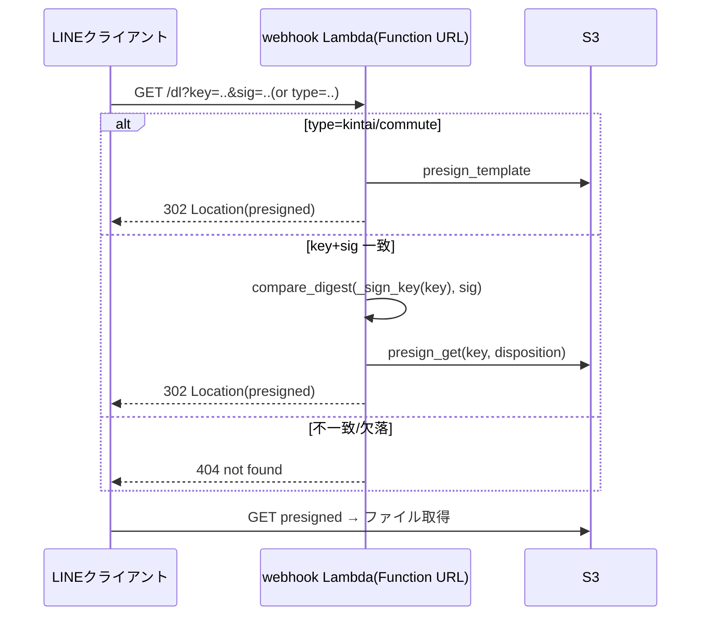
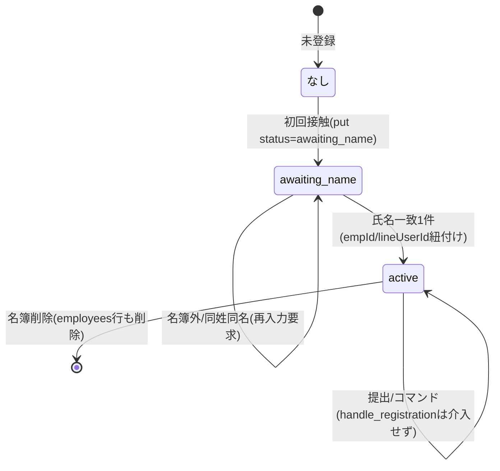

# 詳細設計書

BrightStar 社内システム ｜ 勤怠・通勤費 提出 LINE Bot

| 項目 | 内容 |
|---|---|
| 文書名 | 詳細設計書 |
| システム名 | BrightStar 社内システム（勤怠・通勤費 提出 LINE Bot） |
| 版数 | 1.0 |
| 作成日 | 2026-06-17 |
| 作成者 | 設計担当（アプリ/インフラ設計） |
| 上位文書 | `docs/02_基本設計書.md`（BD/IF/TBL-NN）、`docs/01_要件定義書.md`（FR/NFR-NN） |
| 用途 | 受託開発 社内システム（詳細設計） |

本書は基本設計を受けて、モジュール構成・関数仕様・シーケンス・状態遷移・エラー処理を定める。各関数に **DD-NN** を付与し、純粋関数は境界値・異常系を含め**単体テストが書ける粒度**で入出力を明記する。実装コードを事実の正とする。

---

## 1. 改訂履歴

| 版数 | 日付 | 改訂内容 | 担当 |
|---|---|---|---|
| 1.0 | 2026-06-17 | 初版作成（基本設計書・実装コードに基づく） | 設計担当 |

---

## 2. モジュール構成（DD-MOD）

### 2.1 ファイルツリーと責務

```
lambda/
├── handlers/
│   ├── line_webhook.py   webhook HTTP入口・ルーティング・提出フロー・人事コマンド・短縮リンク
│   └── reminder.py       定時/手動リマインド本体
└── common/
    ├── business.py       業務ロジック中核（名簿/登録/検証/提出/差集合）
    ├── xlsx.py           xlsxセル読取（標準ライブラリ）
    ├── jpholiday.py      日本祝日判定
    ├── i18n.py           文言（ja既定/zh併記）・種別表示名
    ├── line.py           LINE APIアダプタ（署名/解析/reply/push/content）
    ├── messaging.py      送信出口（現状 LINE push）
    ├── s3util.py         S3存取・キー設計・presign・ZIP
    ├── db.py             DynamoDBテーブル句柄
    └── config.py         環境変数・定数・SSM資格情報
```

### 2.2 主要ファイルの公開要素

| ファイル | 主な公開関数 |
|---|---|
| business.py | `current_period`, `normalize_period`, `roster_*`, `_next_emp_id`, `roster_resolve`, `is_hr`, `handle_registration`, `infer_type`, `check_file_period`, `check_name`, `_norm_name`, `holiday_work_warnings`, `missing_dates`, `save_submission`, `record_submission`, `stash_pending`, `resolve_pending`, `is_late_resubmit`, `submitters`, `missing`, `missing_all_types`, `roster_status` |
| xlsx.py | `cell_map`, `read_cell`, `col_of`, `to_date`, `cell_year_month`, `is_number` |
| line_webhook.py | `handler`, `_route`, `_route_text`, `_handle_file`, `_do_submit`, `_handle_download`, `_sign_key`, `_dl_link`, `_handle_roster_admin`, `_hr_missing`, `_hr_remind`, `_hr_roster_messages`, `_bulk_download_msg`, `_history_messages` |
| reminder.py | `handler` |

---

## 3. 関数仕様（DD-NN）

凡例：型は Python 表記。`bytes` は xlsx バイナリ。日付は `datetime.date`。

### 3.1 business.py 純粋系・検証系

#### DD-01 `normalize_period(text) -> str`（FR-16/17/18, BD-04）

- 概要: ユーザー文字列から対象年月 `YYYYMM` を抽出。取れなければ当月。
- 引数: `text: str | None`
- 戻り値: `str`（6桁 `YYYYMM`）
- 主要ロジック:
  1. `text` が falsy → `current_period()`。
  2. 正規表現 `(20\d{2})\D?(\d{1,2})` 一致 → `"%s%02d" % (g1, int(g2))`。
  3. `(\d{1,2})\s*月` 一致 → 当年 + 月2桁。
  4. いずれも非一致 → 当月。
- 境界値/異常系（テスト観点）:
  - `"[202606]"` → `"202606"` / `"2026-6"` → `"202606"`（月ゼロ詰め）
  - `"6月"` → 当年+`"06"` / `"12月"` → 当年+`"12"`
  - `""` / `None` / `"未提出確認"` → 当月（`current_period()`）
  - ※注: `"20260"` のような曖昧入力は正規表現の貪欲一致に依存。月>12 のガードは本関数には無い（`"202613"` → `"202613"`）。テスト時は妥当月のみを前提。
- 例外: なし（常に文字列返却）。

#### DD-02 `infer_type(file_name, text="") -> str | None`（FR-05/06）

- 概要: ファイル名＋テキストから提出種別を判定。
- 引数: `file_name: str|None`, `text: str=""`
- 戻り値: `"kintai"` | `"commute"` | `None`
- 主要ロジック:
  1. `s = (file_name + " " + text).lower()`。
  2. 勤怠キーワード（作業時間/作業/記録簿/時間記録/勤怠/考勤/kintai/勤務/出勤/工時/工时）いずれか含む → `"kintai"`。
  3. 経費キーワード（経費/費用/费用/通勤/commute/交通/keihi/経费/经费）いずれか含む → `"commute"`。
  4. どちらも無 → `None`。
- 境界値/異常系:
  - `"作業時間記録簿_202606.xlsx"` → `"kintai"`
  - `"経費（山田）.xlsx"` → `"commute"`
  - `"file.xlsx"` → `None`（→ 保留へ）
  - 判定は **kintai 優先**（kintai 分岐が先）。両キーワードを含む文字列は `"kintai"`。
  - `None, ""` → `None`。大小無視（`"KINTAI"` → `"kintai"`）。

#### DD-03 `check_file_period(type_, data, period) -> (bool, str|None)`（FR-07）

- 概要: 提出ファイルの年月セルが `period` と一致するか。
- 引数: `type_: str`, `data: bytes`, `period: str(YYYYMM)`
- 戻り値: `(ok: bool, found: "YYYY-MM"|None)`
- 主要ロジック:
  1. 参照セル `PERIOD_CELL[type_]`（kintai=B5 / commute=A1）。未定義種別 → ref=None。
  2. `xlsx.cell_year_month(data, ref)` で `(y,m)` 取得。None → `(False, None)`。
  3. `want=(int(period[:4]),int(period[4:]))`、`found="%04d-%02d"%ym`。
  4. `(ym==want, found)` を返す。
- 境界値/異常系:
  - 一致: B5/A1 の年月 == period → `(True, "2026-06")`
  - 不一致: 月違い → `(False, "2026-05")`（**保存しない**）
  - 読取不可（空セル/壊れファイル/未対応種別）→ `(False, None)`（period_unreadable）
- 例外: 内部 `cell_year_month` が None を返す設計で例外送出はしない。

#### DD-04 `_norm_name(s) -> str`（FR-08, 補助）

- 概要: 氏名比較用の正規化。
- ロジック: 全角空白 `　` 除去 → `\s+` 除去 → strip。
- 境界値: `"山田 太郎"` / `"山田　太郎"` / `"山田太郎 "` → すべて `"山田太郎"`。`None` → `""`。

#### DD-05 `check_name(type_, data, user_id) -> (bool, str|None)`（FR-08）

- 概要: 勤務表 B3 氏名が登録氏名と一致するか。対象外種別は常に OK。
- 引数: `type_`, `data: bytes`, `user_id: str`
- 戻り値: `(ok: bool, found_name: str|None)`
- 主要ロジック:
  1. `ref=NAME_CELL.get(type_)`。commute 等は ref=None → `(True, None)`。
  2. `found=xlsx.read_cell(data, "B3")`、`want=emp_name(user_id)`。
  3. `found` か `want` が falsy → `(False, found)`。
  4. `(_norm_name(found)==_norm_name(want), found)`。
- 境界値/異常系:
  - commute → `(True, None)`（チェック対象外）
  - kintai 一致（空白差異含む）→ `(True, "山田太郎")`
  - kintai 不一致 → `(False, "別人")`（**保存しない**）
  - B3 空 or 登録氏名なし → `(False, found)`
- 依存: `emp_name`（roster/employees 参照）→ 単体テストは emp_name をモック。

#### DD-06 `holiday_work_warnings(type_, data) -> list[str]`（FR-09）

- 概要: 勤務表で休日（土日・祝日）に時間（6/7行）入力のある日を列挙。
- 引数: `type_`, `data: bytes`
- 戻り値: `["12/7(土)", "12/23(月・祝)", ...]`（昇順）
- 主要ロジック:
  1. `type_!="kintai"` → `[]`。
  2. `m=xlsx.cell_map(data)`。
  3. 各セル ref が `^[A-Z]+5$`（5行=日付行）のものを走査。
  4. `col=col_of(ref)`、`d=to_date(val)`。`d` が None or `is_rest_day(d)` 偽 → skip。
  5. 同列 6行 or 7行が数値（`is_number`）→ 当日を候補に。
  6. 昇順ソート → `_fmt_day` で整形。
- 境界値/異常系:
  - 平日に時間入力 → 警告対象外。
  - 土曜（rest_day）かつ時間入力 → `"M/D(土)"`。
  - 祝日 → `"M/D(曜・祝)"`（`_fmt_day` が `holiday_name` で `・祝` 付与）。
  - 休日だが時間空 → 対象外。
  - commute / 壊れファイル（cell_map空）→ `[]`。
- 依存: `xlsx.cell_map / to_date / is_number / col_of`, `jpholiday.is_rest_day / holiday_name`。

#### DD-07 `missing_dates(type_, data, period) -> list[int]`（FR-10）

- 概要: 勤務表 5 行目の日付が 1日〜月末まで揃うか。欠落日（int）を返す。
- 引数: `type_`, `data: bytes`, `period: str(YYYYMM)`
- 戻り値: `list[int]`（欠落日、昇順）
- 主要ロジック:
  1. `type_!="kintai"` → `[]`。
  2. `last=calendar.monthrange(y,mo)[1]`（月末日）。
  3. 5行セルの `to_date(val)` で `d.year==y and d.month==mo` の日を present に集積。
  4. `[d for d in 1..last if d not in present]`。
- 境界値/異常系:
  - 全日揃う → `[]`。
  - 1日と月末欠落 → `[1, last]`。
  - うるう年2月 → `last=29`。30日まで月（6/9/11月）→ `last=30`。
  - 他月の日付（period 外）は present に数えない。
  - commute → `[]`。
- 依存: `xlsx.cell_map / to_date`, `calendar.monthrange`。

#### DD-08 `is_late_resubmit(period) -> bool`（FR-25）

- 概要: 跨月再提出か（過去月への補提出か）判定。
- ロジック: `current_period() > period`（文字列比較。`YYYYMM` は辞書順=時系列順）。
- 境界値: 当月 period → False。先月以前 period → True。未来月 → False。

#### DD-09 `_next_emp_id() -> str`（FR-20）

- 概要: 名簿の `E%03d` 最大値+1 を採番。
- ロジック: roster 全件走査、`empId` が `E`+数字のもの最大値 mx → `"E%03d"%(mx+1)`。
- 境界値: 空名簿 → `"E001"`。`E001,E003` 存在 → `"E004"`（最大+1。歯抜けは埋めない）。`E1`（桁不足）も `E`+数字なら対象（mx=1）。非 `E` 形式は無視。

#### DD-10 `roster_resolve(id_or_name) -> dict | None`（FR-21/22）

- 概要: empId or 氏名で名簿1件を特定。氏名が複数一致なら None（消歧必要）。
- ロジック:
  1. `id_or_name` で `roster_get` 命中 → その item。
  2. 氏名照合 `roster_find_by_name` の結果 1件 → それ、それ以外 → None。
- 境界値/異常系:
  - `"E003"`（存在）→ その行。
  - 一意な氏名 → その行。
  - 同姓同名（複数一致）→ None。
  - 該当なし → None。
- 依存: `roster_get / roster_find_by_name`。

#### DD-11 `handle_registration(user_id, text) -> (bool, str|None)`（FR-01/02/03/04）

- 概要: 未登録/登録中ユーザーの会話を接管し、氏名照合で紐付け。
- 戻り値: `(handled, reply_text)`。`handled=False` で本機能は介入せず通常ルーティングへ。
- 主要ロジック:
  1. `link=get_employee(user_id)`。`link.status=="active"` → `(False, None)`（介入しない）。
  2. `link` 無し → employees に `status=awaiting_name` を put、`(True, ask_name)`。
  3. `status=="awaiting_name"`:
     - `matches=roster_find_by_name(text)`。
     - 0件 → `(True, not_in_roster)`。
     - 2件以上 → `(True, dup_name)`。
     - 1件 → employees を active 化 + empId/name 設定、roster に lineUserId 設定、`(True, registered)`（メニューは role で分岐）。
  4. その他 → `(False, None)`。
- 境界値/異常系:
  - 既 active → 介入しない（提出/コマンドへ流れる）。
  - 友だち追加直後（link無し）の任意発言 → 氏名入力依頼。
  - 名簿外氏名 → not_in_roster。同姓同名 → dup_name。
- 副作用: employees put/update、roster update。単体テストは db/roster をモック。

### 3.2 business.py 差集合・状態系

#### DD-12 `submitters(period, type_) -> set[str]`（FR-15/16/17/24）

- 概要: ある月・種別の提出者 lineUserId 集合を GSI1 query で取得。
- ロジック: `gsi1pk="{period}#{type_}"` を query、`gsi1sk`（userId）を集積。ページング対応。
- 戻り値: `set[str]`。
- 境界値: 提出なし → 空集合。複数提出（再提出）は重複排除され userId 単位。

#### DD-13 `missing(period, type_) -> list[dict]`（FR-16）

- 概要: 指定種別の未提出名簿メンバー。
- ロジック: `done=submitters(...)`、roster 全員のうち `lineUserId not in done`（未紐付けも未提出扱い）を返す。
- 境界値: 全員提出 → `[]`。未紐付け社員は常に未提出側。

#### DD-14 `missing_all_types(period) -> dict`（FR-16/17/24）

- 概要: いずれかの必須種別が未提出の社員を集約。
- 戻り値: `{empId: {emp, missing_types:[...], lineUserId, linked:bool}}`。
- ロジック: 各 type の submitters を取り、社員ごとに未提出 type を集計。`miss` 非空のみ収録。
- 境界値: 全員全種別提出 → `{}`。片方のみ提出 → その type のみ missing。

#### DD-15 `roster_status(period) -> list[dict]`（FR-15）

- 概要: 名簿×種別の提出マトリクス。
- 戻り値: `[{emp, types:{type: item|None}, linked:bool}]`。
- ロジック: 紐付け済社員は `my_submissions(lineUserId)` から当月分を type 別に格納、未紐付けは全 None。
- 境界値: 未紐付け社員 → 全 type None・linked=False。

#### DD-16 `save_submission(user_id, type_, data, period=None) -> (str, str, bool)`（FR-11/25）

- 概要: 提出物を S3 保存し submissions に記録。重複可。
- 戻り値: `(period, s3_key, resubmit)`。`resubmit` は同 period#type の既存有無。
- ロジック: `period=period or current_period()` → `_has_submission` で resubmit 判定 → `s3util.put_submission` → `record_submission`。
- 境界値: 初回 → resubmit=False。同月同種別2回目 → resubmit=True（新バージョン保存）。

### 3.3 xlsx.py 純粋関数

#### DD-17 `cell_map(data) -> dict[str,str]`（FR-07〜10 基盤）

- 概要: xlsx の {セル参照: 値文字列}。空セルは含めない。失敗時空 dict。
- ロジック: zip 展開 → sharedStrings 解決（rPh ふりがな除外）→ 先頭シートの `c` 要素走査。`t="s"`=共有文字列, `inlineStr`, それ以外は `v` テキスト。
- 境界値/異常系:
  - 壊れた/非xlsxバイト → 空 dict（例外捕捉）。
  - 空セル（値 None/""）は dict に含めない。
  - 共有文字列インデックス不正 → 当該セル None 扱い（含めない）。

#### DD-18 `read_cell(data, cell_ref) -> str | None`

- 概要: `cell_map(data).get(cell_ref)`。存在しなければ None。

#### DD-19 `col_of(ref) -> str | None`

- 概要: セル参照から列文字を抽出。`"B5"` → `"B"`、`"AA12"` → `"AA"`、不正 → None。

#### DD-20 `to_date(val) -> date | None`（FR-09/10 基盤）

- 概要: セル値 → date。日付シリアル数値 or `YYYY/M/D` 文字列。
- ロジック:
  1. None → None。
  2. float 変換可かつ `20000<=f<=80000` → `date(1899,12,30)+timedelta(days=int(f))`（1900日付システム）。
  3. `(20\d{2})\D(\d{1,2})\D(\d{1,2})` 一致 → `date(y,m,d)`（不正日は None）。
  4. 非該当 → None。
- 境界値/異常系:
  - シリアル `45810`（範囲内）→ 対応日付。範囲外数値（例 `100`）→ 文字列解釈へ→None。
  - `"2026/6/1"` / `"2026-06-01"` → `date(2026,6,1)`。
  - `"2026/13/1"`（不正月）→ None（ValueError 捕捉）。
  - `"あ"` / None → None。

#### DD-21 `cell_year_month(data, cell_ref) -> (int,int) | None`（FR-07 基盤）

- 概要: セルから `(year, month)` 推定。
- ロジック: `read_cell` → None なら None → `to_date` 成功なら `(d.year,d.month)` → 失敗時 `_ym_from_text`（`(20\d{2})\D{0,3}?(\d{1,2})`、1<=mo<=12）。
- 境界値/異常系:
  - 日付セル `2026/6/1` → `(2026,6)`。
  - 文字列 `"2026年6月"` → `(2026,6)`。
  - 月>12 のテキスト → None。
  - 空/読取不可 → None。

#### DD-22 `is_number(val) -> bool`

- 概要: float 変換可なら True。
- 境界値: `"8.5"`→True / `"08:00"`→False（コロン不可）/ None→False / `""`→False。

### 3.4 jpholiday.py

#### DD-23 `is_rest_day(d) -> bool`（FR-09 基盤）

- 概要: 土日 or 祝日。
- ロジック: `d.weekday()>=5 or is_holiday(d)`。
- 境界値: 月曜祝日（成人の日等）→ True。平日 → False。日曜 → True。
- ※注: `holiday_name/is_holiday` は固定日・ハッピーマンデー・春分秋分・振替休日・国民の休日を算定。2020-2021 五輪特例は未対応（要件上影響軽微）。

### 3.5 line_webhook.py（HTTP・ルーティング・提出）

#### DD-24 `handler(event, context) -> dict`（FR-28, NFR-02/08）

- 概要: Function URL の入口。GET→ダウンロード、POST→署名検証→ルーティング。
- ロジック:
  1. method==GET → `_handle_download(event)`。
  2. `body_bytes=_raw_body(event)`、`sig=X-Line-Signature`。
  3. `line.verify_signature` 偽 → `{statusCode:403}`。
  4. `line.parse_events` の各 ev を `_route` で処理。個別 try/except（失敗ログ・継続）。
  5. `{statusCode:200, body:"OK"}`。
- 異常系: 署名NG=403、個別イベント失敗でも全体200。

#### DD-25 `_sign_key(key) -> str`（FR-14, NFR-03）

- 概要: S3キーの HMAC-SHA256（line_secret）先頭16桁。
- 境界値: 同一 key → 同一署名（決定的）。検証は `compare_digest`（定数時間）。

#### DD-26 `_handle_download(event) -> dict`（FR-12/14/18, IF-04）

- 概要: GET /dl の処理。
- ロジック:
  1. `type` が SUBMISSION_TYPES → `presign_template` へ 302。
  2. `key`+`sig` 一致（`compare_digest(_sign_key(key), sig)`）→ presigned へ 302。`.zip` は content-type=application/zip / ascii=export.zip。
  3. それ以外 → 404。
- 異常系: 署名不一致/欠落 → 404。

#### DD-27 `_handle_file(uid, ev, rt) -> None`（FR-05/06）

- 概要: ファイル受信時の処理。
- ロジック: `line.download_content` → 失敗 reply(submit_fail)。`infer_type(fname)` 判定可 → `_do_submit`、不可 → `stash_pending` + reply(ask_type)。
- 異常系: content 取得失敗 → submit_fail。

#### DD-28 `_do_submit(uid, type_, data, rt) -> None`（FR-07〜11/25）

- 概要: 提出の検証→保存→返信。
- ロジック:
  1. `check_file_period` 不一致 → period_mismatch / period_unreadable で reply、**保存せず return**。
  2. `check_name` 不一致 → name_mismatch で reply、**保存せず return**。
  3. `save_submission` → submit_ok。
  4. `holiday_work_warnings` / `missing_dates` あれば警告メッセージ追加（保存はする）。
  5. `reply_messages`（最大5通）。
  6. `_maybe_notify_resubmit`（跨月再提出時のみ人事 push）。
- 異常系: 年月/氏名 NG は保存しない。警告は保存後の追記。

#### DD-29 `_route(ev, base) -> None`（FR-01〜27）

- 概要: 1イベントのルーティング。
- ロジック: event(subscribe)→welcome+ask / text→登録接管→種別語pending転正→テンプレ/一覧/一括/履歴/名簿/汎用テキスト / file・image→active確認→`_handle_file`。
- 異常系: 非active のファイル送信 → welcome+ask（登録誘導）。

#### DD-30 `_handle_roster_admin(uid, raw) -> str`（FR-19〜22）

- 概要: 名簿 CRUD コマンド解釈。
- ロジック: 空白分割 → cmd 分岐（一覧/追加/変更/削除）。引数不足 → crud_usage。追加=`roster_add`、変更=`roster_resolve`+`roster_update_field`、削除=`roster_resolve`+`roster_delete`。各成功後 `_broadcast_roster_change`。
- 異常系: 対象なし → roster_not_found。フィールド/role 不正 → crud_usage。

#### DD-31 `_hr_missing(text) -> str`（FR-16）

- 概要: 未提出者一覧文字列。`normalize_period`+`infer_type` で月/種別決定。全提出 → all_submitted。種別指定有=`missing`、無=`missing_all_types`。未紐付けは `※Line未登録` 付記。

#### DD-32 `_hr_remind(uid, text) -> str`（FR-17, NFR-08）

- 概要: 催促。`missing_all_types` 空 → all_submitted。非空 → reminder を `InvocationType=Event` で invoke、連携人数を remind_sent で返信。

#### DD-33 `_hr_roster_messages(period) -> list[dict]`（FR-15）

- 概要: 提出状況一覧（未提出置頂・✓/✗）。~4500字で分割、最大5通。下線なし（DLは一括DL誘導）。

#### DD-34 `_bulk_download_msg(period, base) -> dict`（FR-18）

- 概要: 当月ZIP（`build_month_zip`）→ DLボタン。0件 → 案内テキスト。

#### DD-35 `_history_messages(uid, base) -> list[dict]`（FR-13）

- 概要: 個人履歴。降順テキスト一覧（最大30）+ 最新10件 carousel（DLボタン）。履歴なし → no_history。

### 3.6 reminder.py

#### DD-36 `handler(event, context) -> dict`（FR-24, PRE-05）

- 概要: 定時/手動リマインド本体。
- ロジック:
  1. `period=event.period or current_period()`、`only=event.type`。
  2. `only` 有 → `missing(period, only)` を targets 化、無 → `missing_all_types(period)`。
  3. 各 target: `lineUserId` 無 → skip++、有 → `messaging.send(remind_text)`、errcode==0 で sent++。
  4. 戻り値 `{sent, period, type}`。
- 異常系: push 失敗（errcode!=0）はログのみ。未紐付けは skip。

---

## 4. 主要シーケンス図（DD-SEQ）

### 4.1 SEQ-01 ファイル提出（FR-05/07/08/09/10/11/25）



### 4.2 SEQ-02 未提出リマインド（FR-17/24）



### 4.3 SEQ-03 初回登録（FR-01/02/03/04）



### 4.4 SEQ-04 短縮DLリンク GET /dl（FR-12/14/18）



---

## 5. 状態遷移（DD-STATE）

### 5.1 employees.status 状態遷移



| 状態 | 意味 | pendingKey |
|---|---|---|
| なし | employees 行なし（未登録） | - |
| awaiting_name | 氏名入力待ち | - |
| active | 名簿紐付け済（提出可） | 種別不明ファイル受信中は pendingKey 有 |

- pending 有無は status と直交。active かつ pendingKey 有のとき、次の種別語で転正→ pendingKey REMOVE。

---

## 6. エラー処理方針（DD-ERR）

| 区分 | 条件 | 応答 | 根拠 |
|---|---|---|---|
| webhook 署名 | X-Line-Signature 欠落/不一致 | 403 "bad signature" | DD-24, FR-28 |
| webhook 個別イベント | `_route` で例外 | ログ出力し継続、全体 200 | DD-24, NFR-08 |
| /dl 署名 | key+sig 不一致/欠落 | 404 "not found" | DD-26, NFR-03 |
| content 取得 | download_content が None | reply(submit_fail) | DD-27 |
| 年月チェック | 不一致/読取不可 | period_mismatch / period_unreadable（保存せず） | DD-28, FR-07 |
| 氏名チェック | 勤怠 B3 不一致 | name_mismatch（保存せず） | DD-28, FR-08 |
| 休日勤務/日付欠落 | 検出 | 警告（保存はする） | DD-28, FR-09/10 |
| 人事コマンド権限 | is_hr 偽 | hr_only | _route/_hr_guard |
| 名簿 CRUD 引数 | 不足/不正 | crud_usage / roster_not_found | DD-30 |
| LINE API 送信 | HTTPError 等 | errcode 返却・ログ・処理継続 | line._post |
| xlsx 解析 | 壊れ/非xlsx | cell_map 空 dict（例外捕捉） | DD-17 |
| S3 取得 | read_object 失敗 | None 返却 | s3util.read_object |

---

## 7. 基本設計 → 詳細設計トレース表（DD-TRACE）

| 基本設計ID | 詳細設計ID（関数） | 備考 |
|---|---|---|
| BD-02-2（署名検証） | DD-24 handler | 403 |
| BD-02-4（短縮リンク） | DD-25 _sign_key / DD-26 _handle_download | 302/404 |
| BD-03（モジュール構成） | DD-MOD | ファイルツリー |
| BD-04-1（社員UI） | DD-27/_handle_file, DD-28/_do_submit, DD-35/_history_messages | 提出/履歴 |
| BD-04-2（人事UI） | DD-30/_handle_roster_admin, DD-31/_hr_missing, DD-32/_hr_remind, DD-33/_hr_roster_messages, DD-34/_bulk_download_msg | 人事各機能 |
| BD-04-3（push） | DD-28(_maybe_notify_resubmit), DD-30(_broadcast), DD-36 | 通知 |
| BD-06 TBL-01（employees） | DD-11 handle_registration, 状態遷移DD-STATE | 会話状態 |
| BD-06 TBL-02（roster） | DD-09 _next_emp_id, DD-10 roster_resolve, DD-30 | 名簿 |
| BD-06 TBL-03/04（submissions/GSI1） | DD-12 submitters, DD-16 save_submission, DD-13/14/15 | 提出/差集合 |
| BD-06 TBL-05（S3キー） | DD-26, s3util(submission_key 等) | キー設計 |
| BD-07（バッチ） | DD-36 reminder.handler | cron/手動 |
| BD-02-1/BD-08（非機能） | DD-17〜23（標準ライブラリ実装） | xlsx/祝日 |
| IF-01/IF-02/IF-03 | DD-24, line.py（verify/parse/reply/push/content） | LINE I/F |
| IF-04 | DD-26 _handle_download | GET /dl |
| IF-06 | DD-32 _hr_remind | Event invoke |

### 7.1 検証ロジック対応（FR ↔ DD）

| FR | DD |
|---|---|
| FR-07 年月 | DD-03 check_file_period（+DD-21 cell_year_month, DD-20 to_date） |
| FR-08 氏名 | DD-05 check_name（+DD-04 _norm_name） |
| FR-09 休日勤務 | DD-06 holiday_work_warnings（+DD-23 is_rest_day, DD-22 is_number） |
| FR-10 日付欠落 | DD-07 missing_dates |
| FR-25 跨月再提出 | DD-08 is_late_resubmit, DD-16 save_submission |

---

（以上）
